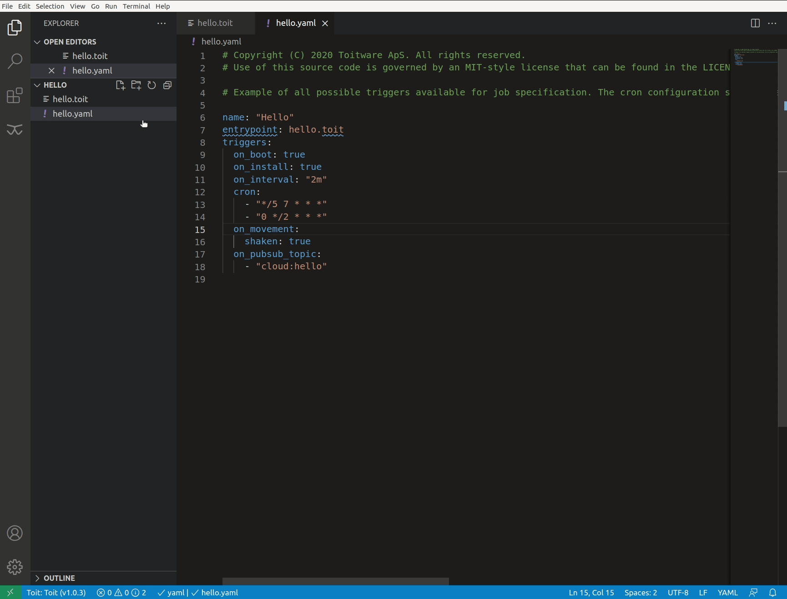
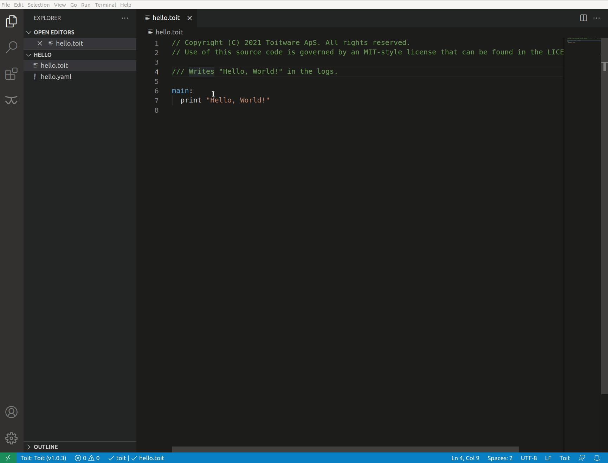
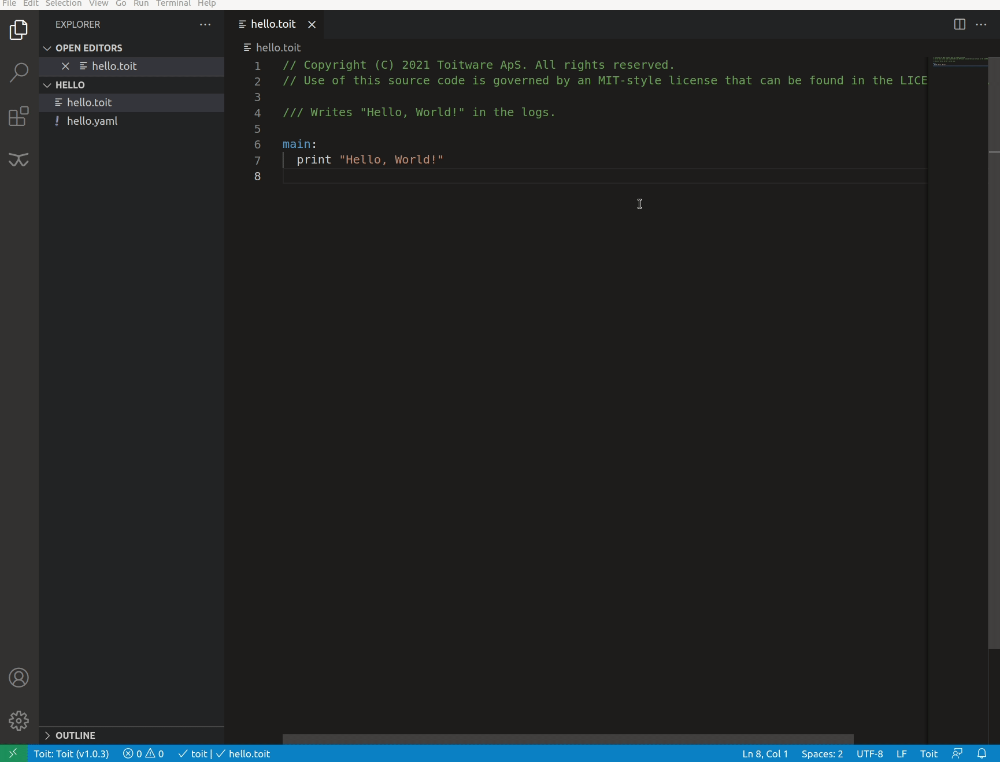
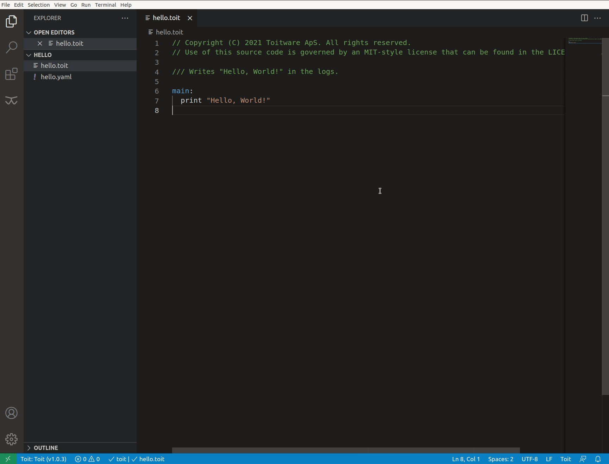
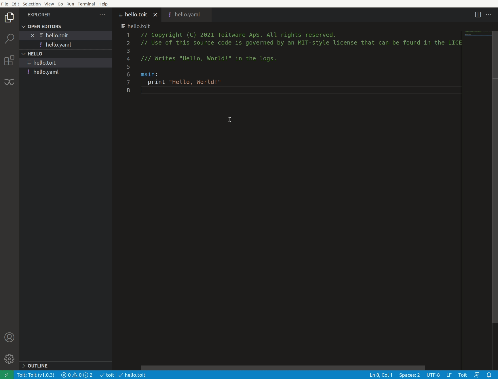
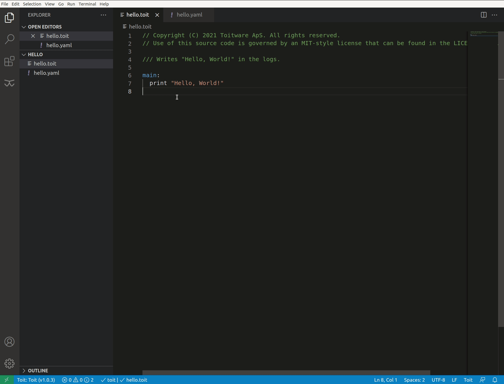

# Toit for Visual Studio Code

The Toit extension add language support for the Toit programming language, including syntax highlighting, integrated static analysis, code completion, and device overview.

## Quick start

- *Step 1:* Install [Toit](https://docs.toit.io/getstarted/installation) and the [toit Visual Studio Code extension](https://marketplace.visualstudio.com/items?itemName=toit.toit).
- *Step 2:* Either place `toit` in your path or set `toit.Path` to the location of `toit`.
- *Step 3:* The extension is activated when you open a `.toit` file.

The extension is now setup and ready to use. Visit the [Toit docs](https://docs.toit.io/) for more information about Toit.

## Extension tour

### See devices and applications
Get an overview of your devices and running apps in the Toit sidebar.

### Deploy and run apps
[Run and deploy](https://docs.toit.io/deploy/runordeploy/) the app you are developing from the device view or from the command pallette.

 
<em>Run apps.</em>

 
<em>Deploy apps.</em>

### Provision and monitor
[Provision](https://docs.toit.io/getstarted/details/provision/) new devices and monitor serial output from the command pallette.

 
<em>Provision device.</em>

 
<em>Monitor device.</em>

### Switch organization
Switch between organizations from the status bar.

### Simulators
Start and stop simulators from the device view or the command pallette.

